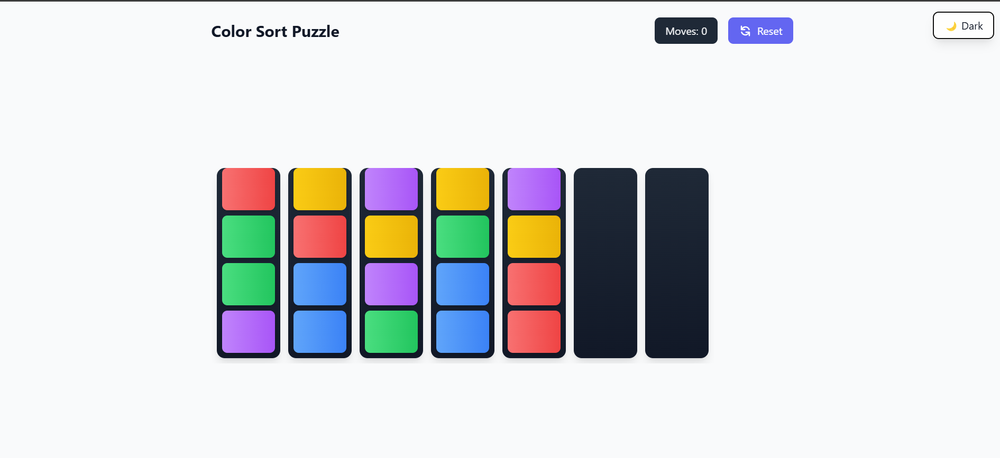
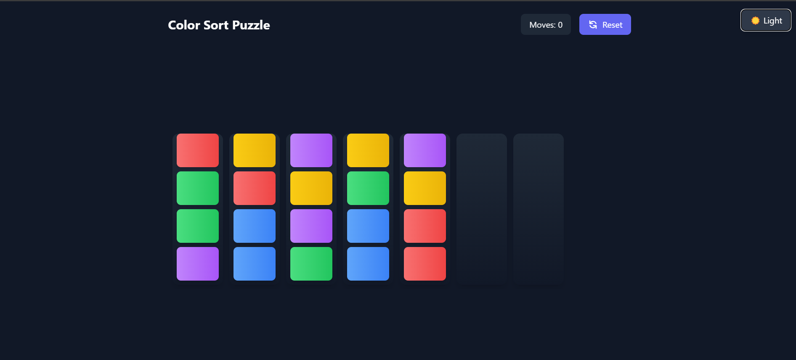
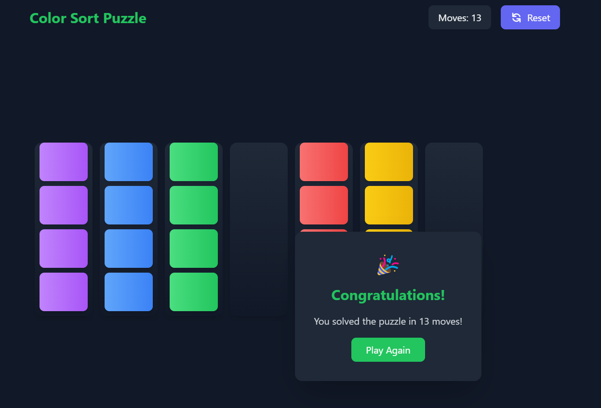

# Color Sort Puzzle Game

A fun and challenging puzzle game where you need to sort colored blocks into matching columns.

Try it out here: [Color Sort Puzzle Game](https://sort-color.netlify.app/)

## How to Play

1. The game starts with several columns filled with randomly colored blocks and 2 empty columns
2. Each column can hold up to 4 blocks
3. You can only move blocks that are at the top of a column
4. Click on a block to select it, then click on an empty space to move it there
5. Your goal is to sort all the blocks so that each column contains blocks of the same color
6. Try to complete the puzzle in as few moves as possible!

## Features

- Responsive design that works on both desktop and mobile
- Dark/light theme support
- Randomly generated puzzles with varying difficulty
- Move counter to track your progress
- Satisfying animations and visual feedback
- Congratulations screen when you win

## Strategy Tips

- Use the empty columns strategically as temporary storage
- Plan your moves ahead to minimize the number of moves needed
- Try to free up a full column early to give yourself more flexibility
- Look for opportunities to directly move blocks to their final position

Give it a try and see how efficiently you can sort the colors!

## Screenshots

_Game interface in light mode showing colored blocks and empty columns_

_Game interface in dark mode with a puzzle in progress_

_Victory screen showing move count and play again button_
